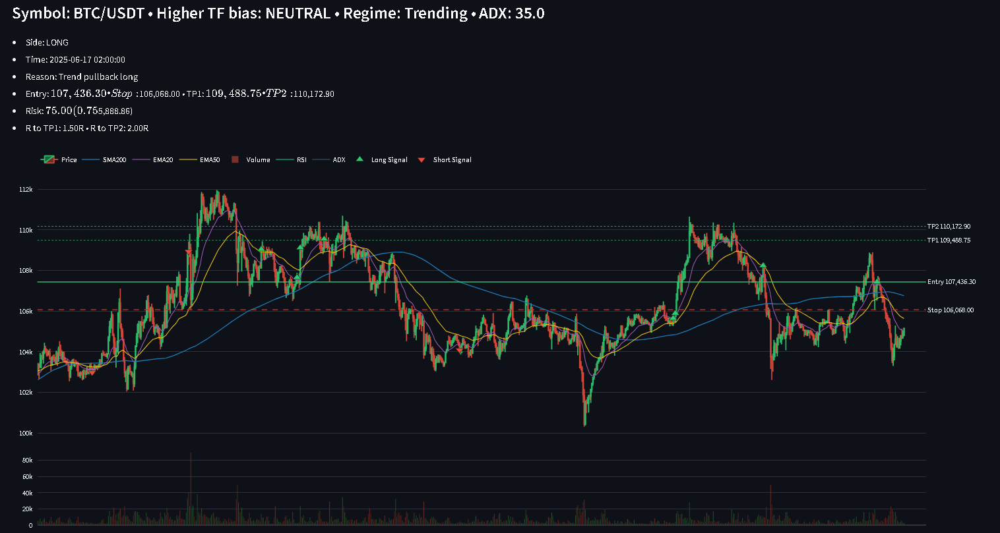

# Trading Advisor 

>[!CAUTION]
>(this code For Educational Purposes Only, Not Financial Advice)

A Streamlit application for exploring long/short trading playbooks using technical indicators on crypto, stocks, and commodities.

- Web: https://github.com/AliHubail2024/Trading-Advisor  
- Clone: https://github.com/AliHubail2024/Trading-Advisor.git

---

## Table of contents

- [Features](#features)
- [Prerequisites](#prerequisites)
- [Quickstart](#quickstart)
  - [macOS/Linux](#macoslinux)
  - [Windows (PowerShell)](#windows-powershell)
- [Usage](#usage)
- [Project structure](#project-structure)

---

## Features

- Streamlit UI with sidebar controls
- Technical indicators and signal generation
- Multiple data sources (e.g., Binance via ccxt if configured)
- Plotly charts with overlays (EMA/SMA/RSI/ADX/Volume, etc.)


---

## Prerequisites

- Python 3.9+ installed and on your PATH
- Git installed
- Internet access (for fetching market data)

Check versions:

```bash
# macOS/Linux
python3 --version
git --version
# Windows
py --version
git --version
```
## Ubuntu/Debian may require:
```bash
sudo apt update
sudo apt install -y python3-venv
```


***macOS/Linux***

```bash
git clone https://github.com/AliHubail2024/Trading-Advisor.git
cd Trading-Advisor
python3 -m venv .venv
source .venv/bin/activate
python -m pip install --upgrade pip wheel
pip install -r requirements.txt
streamlit run app.py
```

**Windows (PowerShell)**

```bash
git clone https://github.com/AliHubail2024/Trading-Advisor.git
cd Trading-Advisor
py -m venv .venv
.\.venv\Scripts\Activate.ps1
python -m pip install --upgrade pip wheel
pip install -r requirements.txt
streamlit run app.py
```


***Usage***

1. Launch the app:

```bash
streamlit run app.py
```

2. In the sidebar:
   
 * Select a data source (e.g., Binance BTC-USD).
 * Choose entry and anchor timeframes.
 * Adjust indicator and risk settings.
 * Toggle overlays (EMA/SMA/RSI/ADX/Volume, etc.).


 -->

***Project structure***
```text
Trading-Advisor/
├─ app.py            # Streamlit UI and main pipeline
├─ data.py           # Data loaders ( Binance via ccxt)
├─ indicators.py     # Technical indicators
├─ strategy.py       # Signal generation logic
├─ plotter.py        # Plotly chart construction
├─ settings.py       # Strategy/risk configuration
└─ requirements.txt  # Python dependencies
```
